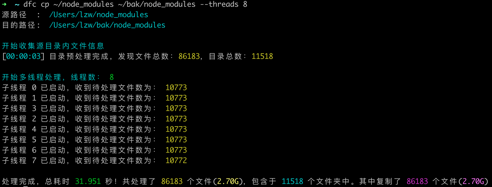
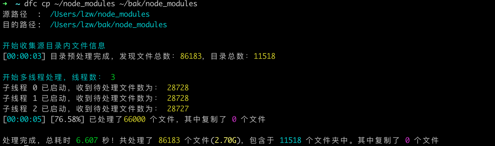

[](https://lzw.me)
[][download-url]

@lzwme/dir-fast-copy
========

[![NPM version][npm-image]][npm-url]
[![node version][node-image]][node-url]
[![npm download][download-image]][download-url]
[![GitHub issues][issues-img]][issues-url]
[![GitHub forks][forks-img]][forks-url]
[![GitHub stars][stars-img]][stars-url]

[stars-img]: https://img.shields.io/github/stars/lzwme/dir-fast-copy.svg
[stars-url]: https://github.com/lzwme/dir-fast-copy/stargazers
[forks-img]: https://img.shields.io/github/forks/lzwme/dir-fast-copy.svg
[forks-url]: https://github.com/lzwme/dir-fast-copy/network
[issues-img]: https://img.shields.io/github/issues/lzwme/dir-fast-copy.svg
[issues-url]: https://github.com/lzwme/dir-fast-copy/issues
[npm-image]: https://img.shields.io/npm/v/@lzwme/dir-fast-copy.svg?style=flat-square
[npm-url]: https://npmjs.org/package/@lzwme/dir-fast-copy
[node-image]: https://img.shields.io/badge/node.js-%3E=_12-green.svg?style=flat-square
[node-url]: https://nodejs.org/download/
[download-image]: https://img.shields.io/npm/dm/@lzwme/dir-fast-copy.svg?style=flat-square
[download-url]: https://npmjs.org/package/@lzwme/dir-fast-copy


nodejs 实现的文件夹快速复制工具。适用于对存在海量小文件的目录进行选择性复制的需求场景。

对于前端开发来说，在 windows 系统下对某些庞大的目录进行复制时，系统自带的复制功能可能令人十分痛苦。如果你遇到此类需求，dfc 小工具或许可以帮助到你。





## 功能特点

- 针对海量小文件，多线程复制速度快
- 自动跳过已存在且大小相同的文件
- 支持模糊过滤，忽略部分文件
- 支持按文件修改时间过滤，只复制新产生的文件
- more...

## 安装与使用

### 全部安装

```bash
npm i -g @lzwme/dir-fast-copy
```

### 使用

```bash
dfc --help

Usage: dfc [options] [command]

Commands:
  cp [options] <srcPath> <descPath>  高效的复制目录
  rm [options] <dirpath>             删除一个目录及其子目录
```

**目录复制：**

```bash
dfc cp --help

Usage: dfc cp [options] <srcPath> <descPath>

高效的复制目录

Options:
  --debug                                调试模式 (default: false)
  -s, --slient                           静默模式 (default: false)
  --threads <num>                        启动多线程的数量。小于 2 表示不启用多线程模式
  --muti-thread-min-files                启用多线程的最小文件数，文件总数低于该值则使用单线程模式(最小值 1000，默认为 3000)
  --exclude <reg...>                     文件排除规则。普通的 glob 规则，支持多个参数
  --min-date-time <1970-01-01T00:00:00>  文件最小日期，低于该日期的文件会被忽略(处理速度更快)
  --no-skip-same-file                    文件<名称与大小均相同>已存在时不跳过(覆盖)。
  --skip-same-file                       文件<名称与大小均相同>已存在时则跳过。 (default: true)
  --progress-interval                    onProgress 进度回调(进度日志更新)的最小间隔时间(ms)，不低于 100ms。默认值 2000
  --cp-during-stats                      多线程模式下，在收集文件信息过程中即开始文件复制（适用于文件数量多信息收集时间长的场景） (default: false)
  -h, --help                             查看帮助信息
```

示例：
```bash
dfc cp ./src ./desc

# 使用 8 子线程复制
dfc cp ./src ./desc --threads 8

# 多线程复制，在收集目录信息时即进行部分复制
dfc cp ./src ./desc --cp-during-stats

# 复制 src 目录至 desc，排除 node_modules 和 dist 目录，排除 .pyc 和 .obj 类型的文件
dfc cp ./src ./desc --exclude /node_modules/** dist/** *.{pyc, .obj}

# 只复制 2020-09-22 00:00:00 之后改动或创建的文件
dfc cp ./src ./desc --min-date-time 2020-09-22

# 强制复制所有文件
dfc cp ./src ./desc --no-skip-same-file
```

**目录删除：**

```bash
dfc rm --help

Usage: dfc rm [options] <dirpath>

删除一个目录及其子目录

Options:
  -f, --force  强制删除，无需确认(否则删除前需确认) (default: false)
  -h, --help   查看帮助信息
```

示例：

```bash
dfc rm ./lzwme-test1
dfc rm -f ./lzwme-test2
dfc rm -f ./lzwme-test3.txt
```

## API 调用方式

### es module

```js
import { fastCopy } from '@lzwme/dir-fast-copy';

const config = {
  src: './test-src',
  dest: './test-dest',
  onProgress: stats => console.log('onProgress:', onProgress),
  onEnd: stats => console.log('onEnd:', onProgress),
};

fastCopy(config).then(stats => {
  if (stats) console.log('done:', stats);
});
```

### Options

```js
/** 默认配置 */
const config = {
  /** 是否静默模式 */
  slient: false,
  /** 是否为 cmd 命令方式调用(dfc --src --desc) */
  iscmd: false,
  /** 源目录路径 */
  src: '',
  /** 输出目录路径 */
  desc: '',
  /** 是否尝试启用多线程模式 */
  enableThreads: true,
  /** 启用线程的最小文件数，文件总数低于该值则不启用多线程模式 */
  enableThreadsMinCount: 500,
  /** 文件过滤规则 */
  filterRegList: [/\.pyc$/, /\/src\/out\//],
  /** 文件最小日期，低于该日期的忽略 */
  minDatetime: new Date('2000-09-15T00:00:00').getTime(),
  /** 目的目录相同文件已存在是否跳过。为 false 则覆盖它 */
  isSkipSameFile: true,
  /** 结束时回调方法 */
  onEnd: null,
  /** 发出进度消息时的回调方法 */
  onProgress: null,
};
```

## License

`@lzwme/dir-fast-copy` is released under the MIT license.

该插件由[志文工作室](https://lzw.me)开发和维护。
